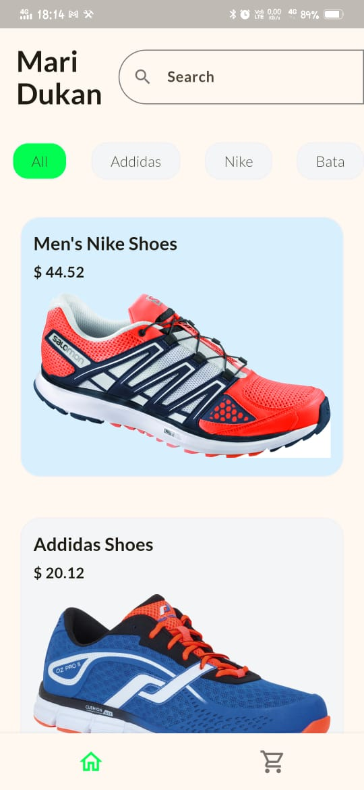
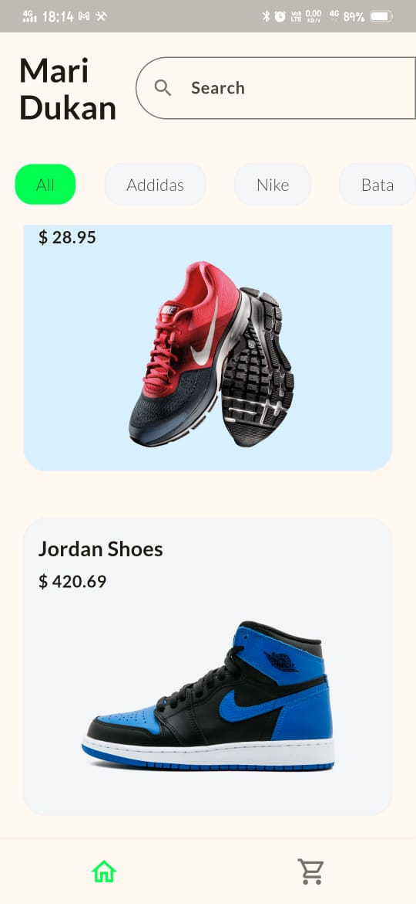
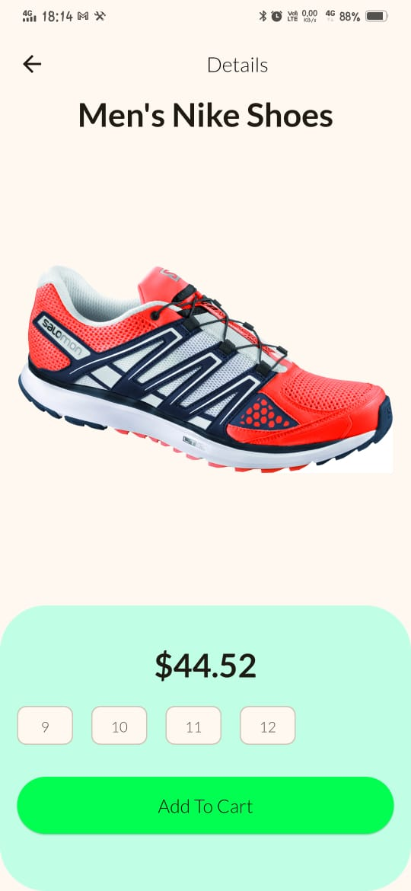
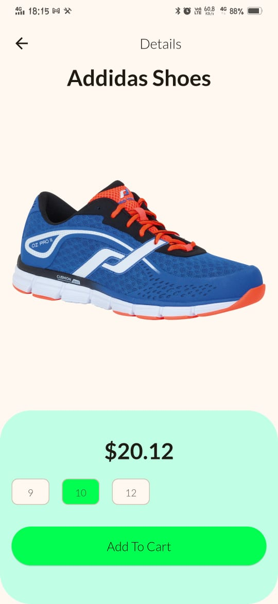
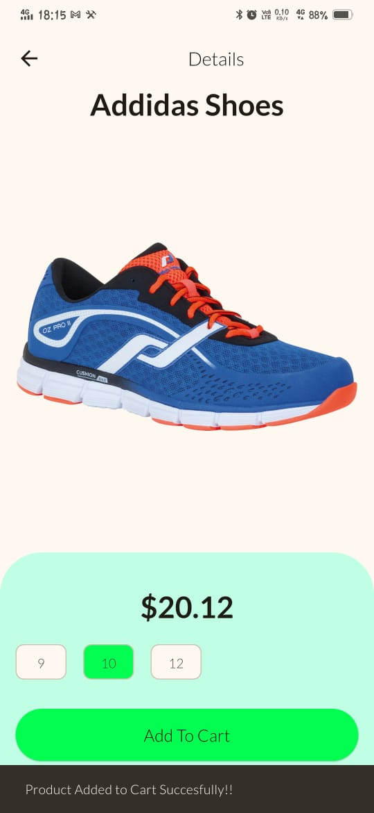
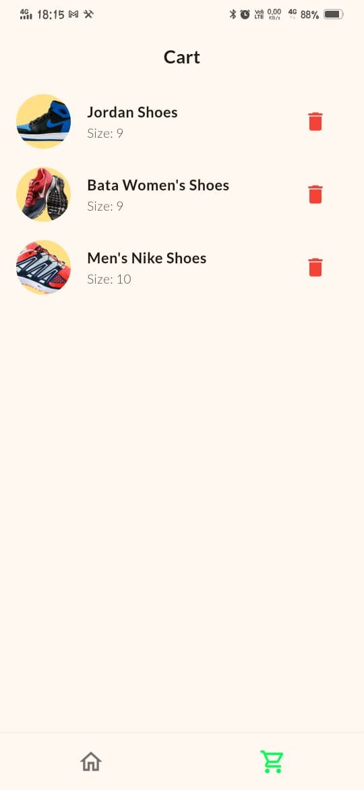
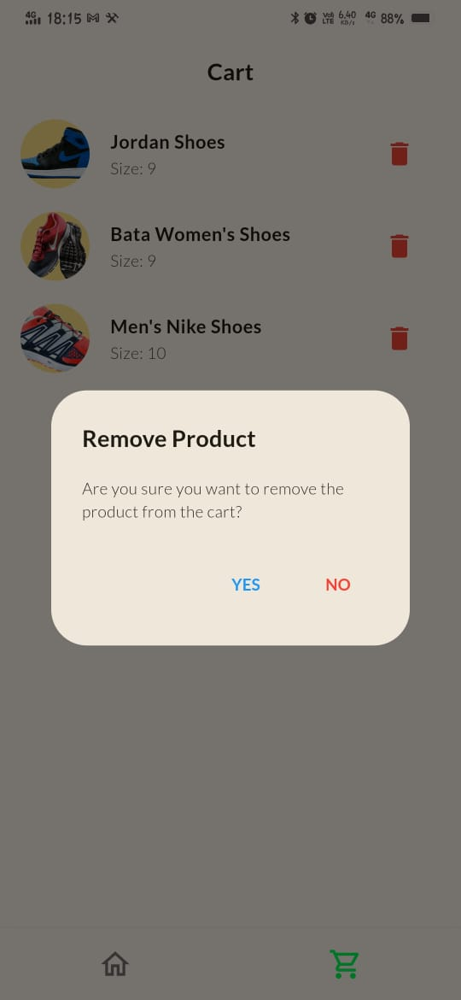

# Shoe Shopping App - Mari Dukaan

## Overview
Mari Dukaan is a Flutter-based shoe shopping application that allows users to browse shoes, view detailed product information, add them to the cart, and proceed with their purchases. The app is built using Flutter and utilizes the Provider package for state management.

## Features
- **Home Page**: Displays a list of available shoes.
- **Product Details Page**: Shows detailed information about a selected shoe, including price and available sizes.
- **Cart Page**: Allows users to view and manage items added to their cart.
- **Navigation Bar**: Enables seamless switching between the product list and cart pages.
- **State Management**: Uses Provider to manage cart operations efficiently.

## Project Structure
```
📂 flutter_shoe_shopping_app
│── 📂 assets
|   ├── 📂 fonts
|   ├── 📂 icons
|   ├── 📂 images
│── 📂 lib
│   ├── 📂 providers
│   │   ├── cart_provider.dart
│   ├── 📂 pages
│   │   ├── home_page.dart
│   │   ├── cart_list_page.dart
│   │   ├── product_details_page.dart
│   ├── 📂 widgets
│   │   ├── product_list.dart
|   |   ├── product_card.dart
│   ├── global_variable.dart 
│   ├── main.dart
│── pubspec.yaml
```

## Installation & Setup
1. Clone the repository:
   ```sh
   git clone https://github.com/your-repo/flutter_shoe_shopping_app.git
   cd flutter_shoe_shopping_app
   ```
2. Install dependencies:
   ```sh
   flutter pub get
   ```
3. Run the app:
   ```sh
   flutter run
   ```

## Dependencies
- Flutter
- Provider

## Screens
### 1. Home Page (home_page.dart)
 
- Displays a list of shoes.
- Users can navigate to product details.
- Navigation bar for switching between home and cart pages.

### 2. Product Details Page (product_details_page.dart)
  
 
- Shows shoe details like price, brand, and available sizes.
- Users can select a size and add the shoe to the cart.

### 3. Cart Page (cart_list_page.dart)
 
- Displays selected shoes.
- Users can remove items from the cart.
- Confirmation dialog before removing items.

## State Management
- **CartProvider (cart_provider.dart)** manages cart operations like adding and removing products.

## Contact
Feel free to reach out at: **ved09003@gmail.com**

---

